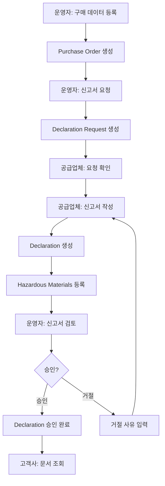

# IHM 관리 시스템 데이터베이스 ERD

## 전체 ERD 다이어그램

```mermaid
erDiagram
    users ||--o| customers : "has"
    users ||--|| suppliers : "has"
    customers ||--o{ ships : "owns"
    ships ||--o{ purchase_orders : "has"
    suppliers ||--o{ purchase_orders : "supplies"
    purchase_orders ||--|| declaration_requests : "requires"
    declaration_requests ||--|| declarations : "produces"
    declarations ||--o{ hazardous_materials : "contains"
    users ||--o{ purchase_orders : "creates"
    users ||--o{ declaration_requests : "creates"
    users ||--o{ declarations : "approves"

    users {
        int id PK
        string username UK
        string email
        string password_hash
        enum user_type "operator/supplier/customer"
        string company_name
        string contact_phone
        boolean is_active
        datetime created_at
        datetime updated_at
    }

    customers {
        int id PK
        int user_id FK "nullable"
        string company_name
        string business_number
        string address
        string contact_person
        string contact_phone
        string contact_email
        datetime created_at
        datetime updated_at
    }

    ships {
        int id PK
        int customer_id FK
        string ship_name
        string imo_number
        string ship_type
        decimal gross_tonnage
        int year_built
        boolean is_active
        datetime created_at
        datetime updated_at
    }

    suppliers {
        int id PK
        int user_id FK
        string company_name
        string business_number
        string address
        string contact_person
        string contact_phone
        string contact_email
        datetime created_at
        datetime updated_at
    }

    purchase_orders {
        int id PK
        int ship_id FK
        int supplier_id FK
        string order_number
        string item_name
        text item_description
        decimal quantity
        string unit
        date order_date
        date delivery_date
        enum status "pending/requested/completed"
        int created_by FK
        datetime created_at
        datetime updated_at
    }

    declaration_requests {
        int id PK
        int purchase_order_id FK
        int supplier_id FK
        date request_date
        date due_date
        enum status "pending/submitted/approved/rejected"
        int created_by FK
        datetime created_at
        datetime updated_at
    }

    declarations {
        int id PK
        int declaration_request_id FK
        int supplier_id FK
        int ship_id FK
        enum declaration_type "MD/SDoC"
        string item_name
        string manufacturer
        string model_number
        json hazardous_materials
        enum compliance_status "compliant/non_compliant"
        string certification_number
        string supplier_signature
        string supplier_name
        date signature_date
        date submitted_date
        date approved_date
        int approved_by FK
        enum status "draft/submitted/approved/rejected"
        text rejection_reason
        datetime created_at
        datetime updated_at
    }

    hazardous_materials {
        int id PK
        int declaration_id FK
        string material_name
        string cas_number
        decimal content_percentage
        string location_in_product
        text remarks
        datetime created_at
    }
```

## 주요 업무 흐름

## 테이블별 설명

### 1. users (사용자)
- 시스템의 모든 사용자 (운영자, 공급업체, 고객사)
- user_type으로 역할 구분

### 2. customers (고객사/선주사)
- 선박을 소유한 회사
- user_id는 optional (로그인이 필요한 경우만)

### 3. ships (선박)
- 고객사가 소유한 선박들
- IMO 번호로 국제적으로 식별

### 4. suppliers (공급업체)
- 선박에 자재를 공급하는 업체
- 반드시 로그인 계정 필요 (user_id 필수)

### 5. purchase_orders (구매 주문)
- 운영자가 등록하는 구매 데이터
- 어떤 선박에 어떤 공급업체가 무엇을 공급하는지

### 6. declaration_requests (신고서 요청)
- 구매 주문에 대한 신고서 작성 요청
- 공급업체에게 발송됨

### 7. declarations (신고서 - MD/SDoC)
- 공급업체가 작성하는 유해물질 신고서
- MD (Material Declaration) 또는 SDoC (Supplier Declaration of Conformity)

### 8. hazardous_materials (유해물질 목록)
- 신고서에 포함된 개별 유해물질 정보
- CAS 번호로 화학물질 식별

## 주요 관계

- **1:1 관계**: users ↔ suppliers (필수), purchase_orders ↔ declaration_requests
- **1:N 관계**: customers → ships, declarations → hazardous_materials
- **N:M 관계**: ships + suppliers (purchase_orders를 통해)
